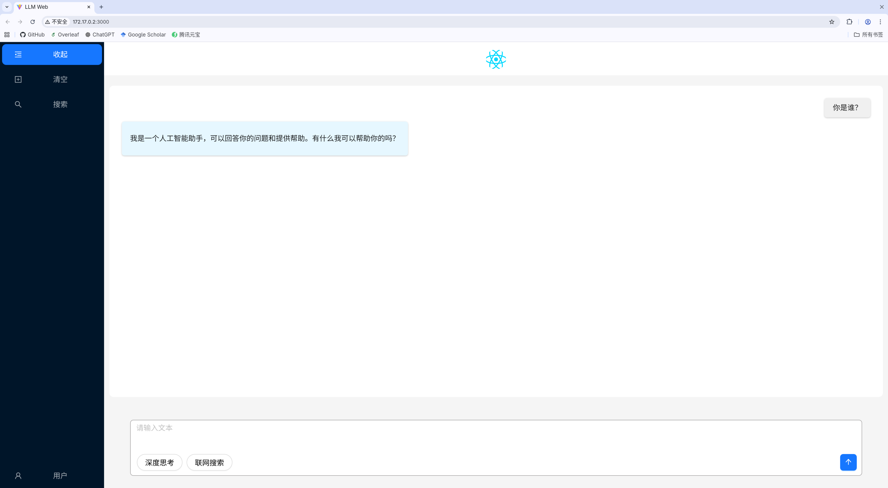

# LLM-Web

This repository aims to build a **ChatGPT-like web frontend** with the **minimal dependencies** and **simplest possible structure**. The goal is to provide a clean starting point for developers who want to create conversational web applications.



## Features

- Built with **React**, **TypeScript**, **Vite**, and **Ant Design**
- Minimal project structure
- Easy to extend and customize
- Lightweight and fast

## Tech Stack

- **React** – Web library
- **TypeScript** – Type safety
- **Vite** – Fast build tool
- **Ant Design** – UI components

## Installation

```bash
# Clone the repository
git clone https://github.com/Aurainting/LLM-Web.git
cd LLM-Web

# Install dependencies
npm install
# or
yarn install
```

## Running the Project

```bash
# Start development server
npm run dev
# or
yarn dev
```
